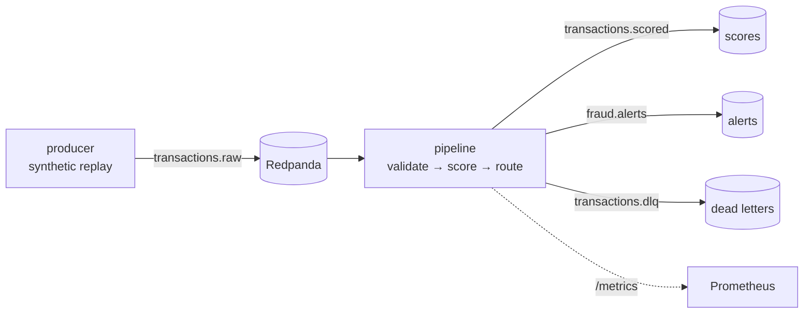

# streaming-fraud-detection

[](https://github.com/minhazda/streaming-fraud-detection/actions/workflows/ci.yml)

Event-driven card-fraud scoring: a Kafka/Redpanda stream processor that scores raw
transactions in real time with the model from
[fraud-detection-mlops](https://github.com/minhazda/fraud-detection-mlops) — the
HTTP serving repo's streaming counterpart.



## Design decisions

- **No train/serve skew, by construction.** Feature engineering is imported from
  `fraud_detection.features` — the exact module the model was trained with. A unit
  test asserts stream-scored probabilities match batch predictions to 1e-9.
- **Fail loudly into a DLQ.** Payloads are validated against a strict pydantic
  schema (`extra="forbid"`); malformed or drifted messages land in
  `transactions.dlq` with the rejection reason instead of crashing the consumer
  or silently reaching the model.
- **Unseen categories degrade gracefully.** Feature columns are re-aligned to the
  training-time list, so a brand-new `merchant_category` scores (one-hots = 0)
  rather than throwing.
- **Testable without a broker.** The pipeline is written against a `MessageBus`
  protocol: unit tests run the full consume→validate→score→route path in memory;
  CI then runs the same pipeline against a real Redpanda end to end.
- **Observable.** Prometheus counters (`sf_transactions_total`, `sf_alerts_total`)
  and histograms for model-scoring time and producer-to-scored latency.

## Quickstart (one command)

```bash
docker compose up --build
```

This starts Redpanda, trains the model in-container (~20s), starts the scoring
pipeline, and replays 2,000 synthetic transactions (1 malformed per 100, to
exercise the DLQ). Watch:

- metrics: <http://localhost:8001/metrics> (raw) · <http://localhost:9090> (Prometheus)
- alerts: `docker compose exec redpanda rpk topic consume fraud.alerts`
- dead letters: `docker compose exec redpanda rpk topic consume transactions.dlq`

## Tests

```bash
pip install -r requirements-dev.txt && pip install -e .
pytest                       # unit suite: trains a small real model, no broker needed
docker compose up -d redpanda
pytest -m integration -s     # end-to-end through a live broker
```

The integration test publishes 300 transactions (6 malformed), runs the pipeline,
and asserts exact scored/alert/DLQ counts plus payload round-trip integrity.
Throughput on the CI runner is printed in the [CI logs](https://github.com/minhazda/streaming-fraud-detection/actions).

## Kubernetes

The same stack runs on Kubernetes (`k8s/`): Redpanda + the pipeline Deployment
(an init container trains the model into a shared volume, so the pod is
self-contained), a replay-producer Job, a metrics Service, and an HPA
(CPU-based; effective max parallelism = the topic's partition count).

CI proves it on every push: a **kind** cluster is created, the image is built
and loaded, everything is deployed, the producer Job replays 500 transactions
(5 malformed), and the job asserts `scored == 500` / `invalid == 5` straight
from the pipeline's Prometheus metrics.

```bash
kind create cluster && docker build -t streaming-fraud:ci . \
  && kind load docker-image streaming-fraud:ci
kubectl apply -f k8s/
kubectl port-forward svc/pipeline-metrics 8001:8001   # then open /metrics
```

## Relation to the companion repos

| Repo | Serving mode |
|---|---|
| [fraud-detection-mlops](https://github.com/minhazda/fraud-detection-mlops) | request/response (FastAPI on Cloud Run, live demo) |
| this repo | event-driven (Kafka consumer, alerts + DLQ) |

Same model, same features, two production serving patterns.
